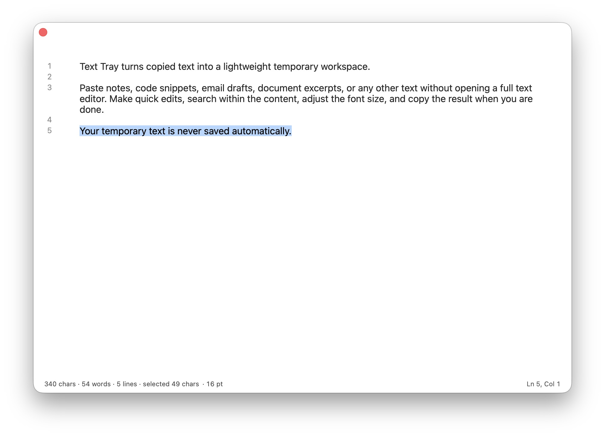
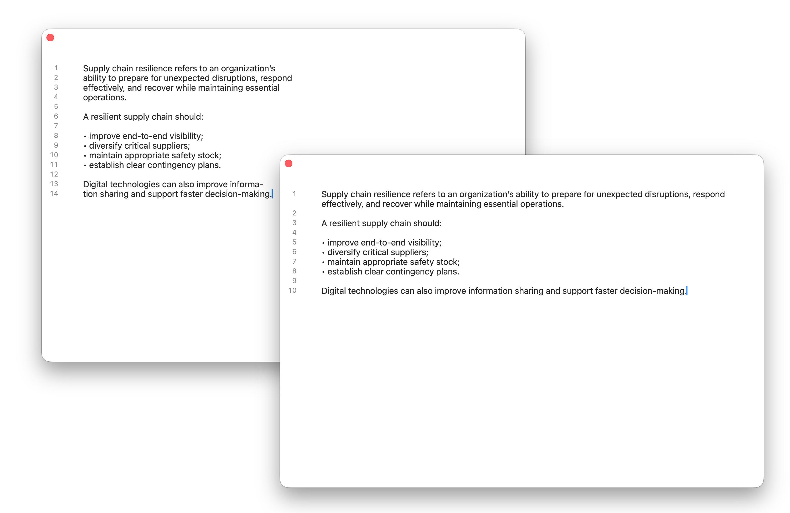
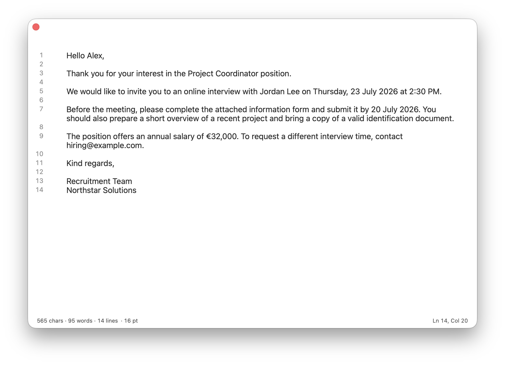
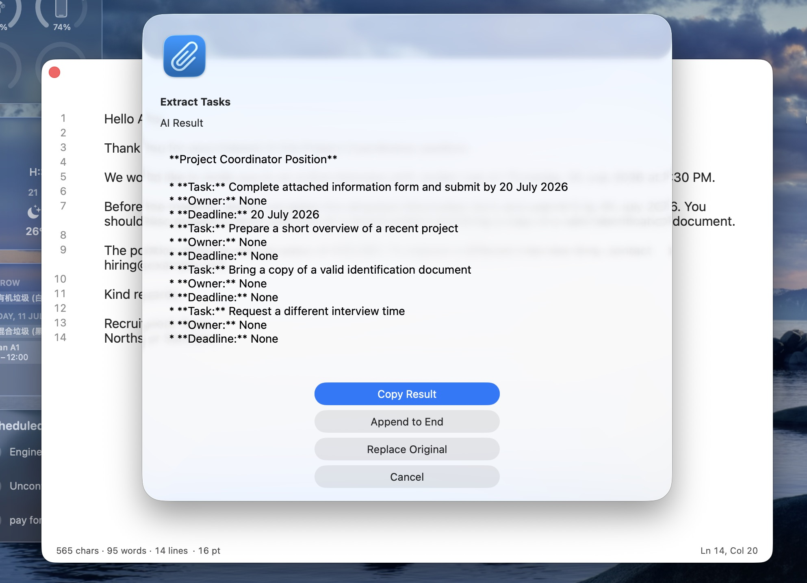
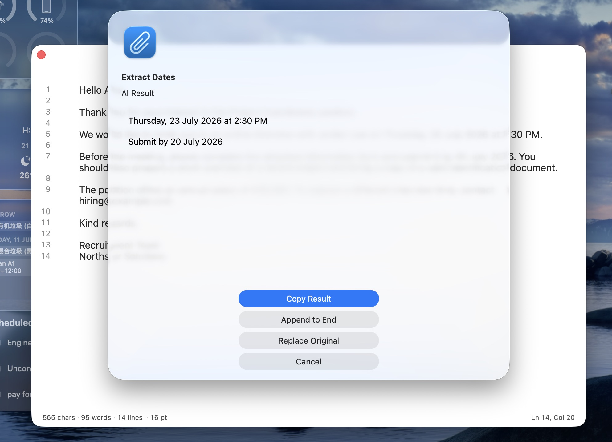
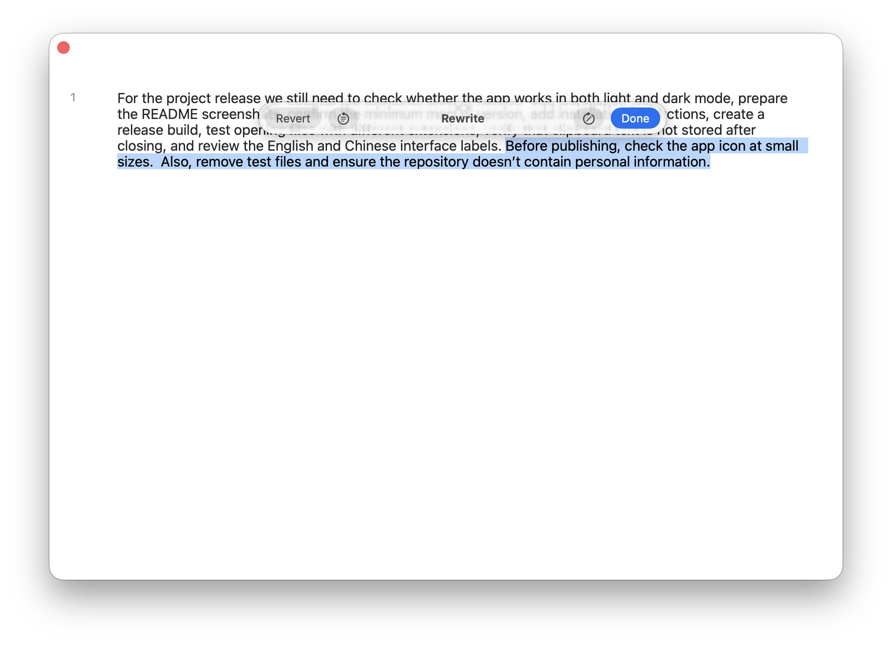
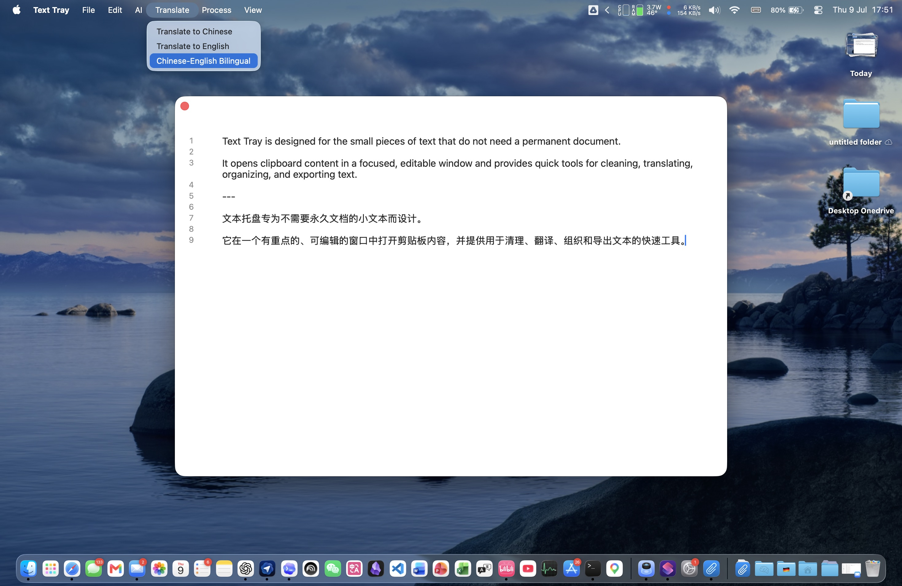
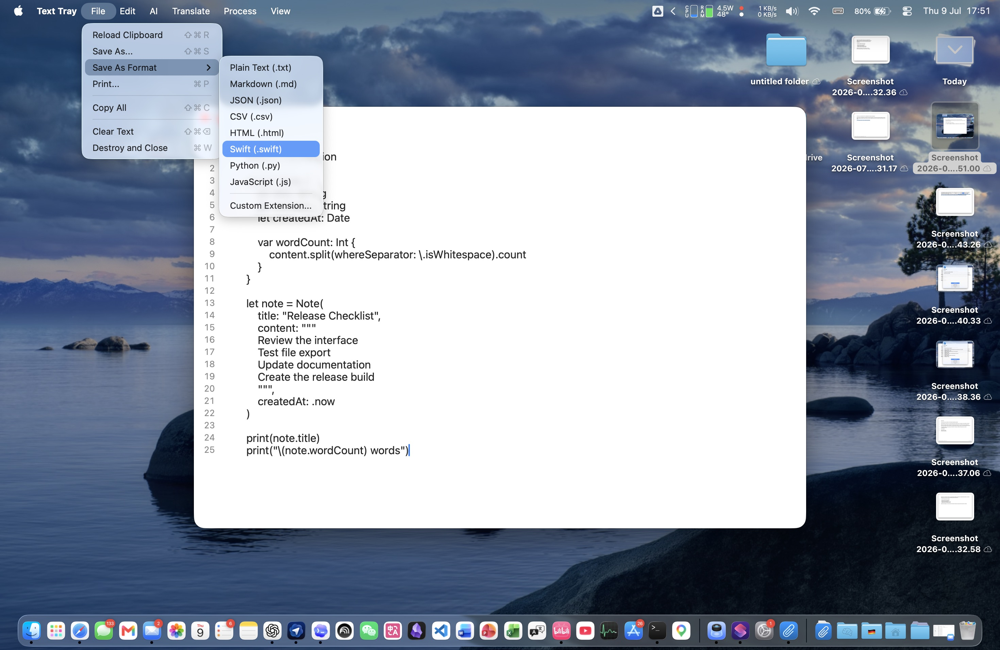
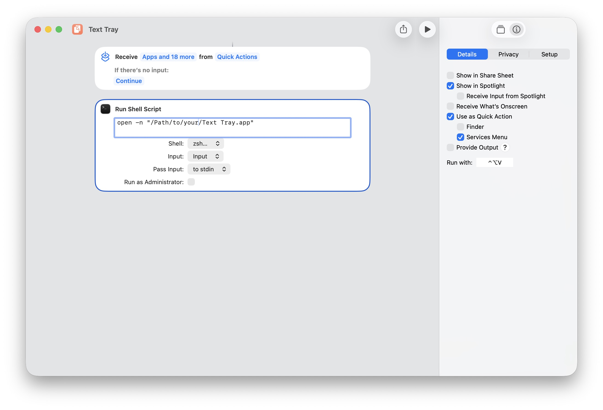

# Text Tray

**Text Tray** is a tiny macOS temporary text tray for the moments when opening a full text editor, Notes window, AI tool, or translation app is too much.

It is designed for quick, disposable text work: view copied text in a larger editable window, check basic counts, clean up simple text problems, run lightweight local AI actions, use system Writing Tools or translation when available, then copy or save the result and move on.

[中文说明](README.zh-CN.md)



## Why

Sometimes you only need to inspect a piece of text for a few seconds:

- the copied text is too small to read comfortably in the source app
- opening a full text editor feels heavy for a temporary note
- Apple Notes is too small or too persistent for throwaway text
- using another AI or translation tool means too many copy, paste, process, copy steps
- you just want to know character count, word count, line count, or cursor position
- you need a quick cleanup before copying or saving the text

Text Tray gives that temporary text a dedicated, lightweight place.

## Features

### Temporary Text Tray

- Open a clean, focused window for copied or passed-in text
- Use it as a temporary reading and editing space instead of opening a full editor
- Keep the window floating when you want it above other apps
- Reload the current clipboard when you need to replace the temporary text

### Reading, Editing, and Counting

- Edit, select, scroll, undo, redo, and search text
- Show line numbers and word wrap
- Adjust font size
- See character count, word count, line count, selection length, font size, and cursor position

### Quick Text Cleanup

- Trim leading and trailing whitespace
- Remove extra blank lines
- Normalize line endings
- Remove trailing spaces on each line
- Repair common PDF line breaks
- Undo the last text processing operation

### Copy, Save, and Print

- Copy the whole text when you are done
- Save text as `.txt`, `.md`, `.json`, `.csv`, `.html`, `.swift`, `.py`, `.js`, or a custom extension
- Use timestamped default file names such as `Text_YYYYMMDDHHMMSS.txt`
- Print the current text

### Smart Assistance

- Extract tasks, dates, amounts, and contacts
- Summarize requirements, explain text, check risks, draft replies, and organize text into checklists or tables
- Use system Apple Intelligence writing assistance when available
- Translate to Chinese, translate to English, or create a bilingual version when system translation is available

### Preferences

- Remember language, pinning, font size, line numbers, word wrap, and statistics display
- Keep text temporary: preferences are saved, text content is not

Text Tray does **not** save your text automatically, keep clipboard history, monitor the clipboard in the background, upload content, or clear the system clipboard.

## Screenshots

### PDF Line Break Cleanup



### AI Text Actions

Use the app's AI menu for quick structured operations such as extracting tasks or dates from temporary text.

Before extraction:



Task extraction:



Date extraction:



### Apple Intelligence Writing Assistance

Use system Apple Intelligence writing assistance directly in the editor when macOS supports it.



### Translation



### Save and Export



### Shortcuts Launcher



## Install

Download `TextTray.zip` from the release assets, unzip it, and open `Text Tray.app`.

If macOS asks for confirmation when opening the app, approve it in System Settings or open it from Finder with Control-click > Open.

## Launch From Shortcuts

Use a Shortcuts "Run Shell Script" action:

```bash
open -n "/Applications/Text Tray.app"
```

You can also pass text directly:

```bash
APP="/Applications/Text Tray.app"
printf '%s' "$SHORTCUT_INPUT" | "$APP/Contents/MacOS/TemporaryClipboardViewer" --stdin
```

## Build From Source

Requirements:

- macOS 13 or later
- Xcode Command Line Tools
- Swift compiler

Build:

```bash
./scripts/build.sh
```

Output:

- `build/Text Tray.app`
- `releases/TextTray.zip`

The build script creates a normal `.app` bundle and packages it as `TextTray.zip`.

## Privacy

Text Tray is intentionally local and temporary.

- No database
- No clipboard history
- No automatic saving of text
- No network requests for local text processing
- No background clipboard monitoring
- No clipboard clearing on close
- Clipboard is only modified when you explicitly copy text

Preferences such as language, font size, line numbers, word wrap, statistics display, and pinning are stored with `UserDefaults`. Text content is not stored.

## License

MIT
